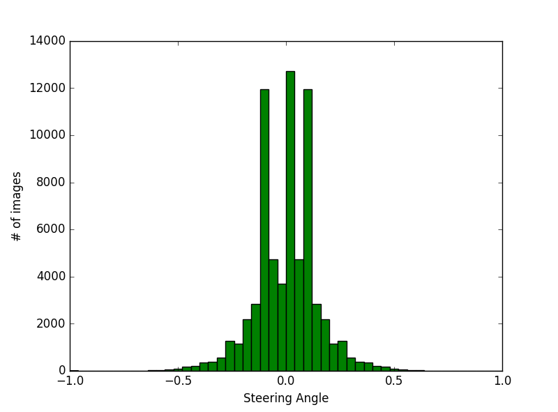
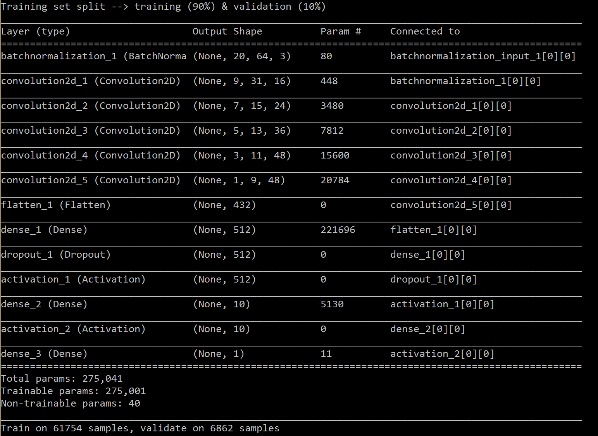

# Udacity Self Driving Car Engineer - Project 3
This readme explains the various aspects of Project 3 - programming a deep neural network that is used to drive a car in a simulator.

# Data collection
While doing the project I found data collection & processing the most difficult part. I spent a lot of time around how to properly load, preprocess & augment the data.
The project task was to record the driving behaviour in a specific track during "normal" driving (i.e. staying in the lane) and "recovery" driving (i.e. driving from the side of the lanes back to the center of the lane). Although I recorded these scenarios in length, I ultimately ended up using the premade data set provided by Udacity for this project. Reason for this is that while the data I generated was actually more in terms of data it was not well balanced. The reason for this is that the keyboard has very bad sensitivity, leading to very abrubt stearing. The resolution of this problem would be to use a gamepad or similar to which unfortunately I did not have access. 

# Image preprocessing
Image preprocessing was not heavily needed for this project as the individual "features" in the images were not that important, rather the overall scenery. I resized the images to 32 x 64 pixels and subsequently cropped off the top 12 pixels which were only the sky and were leading initially to some unexpected behaviour. After that I adjusted the gamma of the image to increase overall contrast and make the lanes more visible for the network.

# Data generation
I mirrored the images & respective labels along their vertical axis to generate more data for the network as well as to adjust for the left bias in track 1

# Train / Validation Set
I split out 10% of the data for the validation set during training. Overall the training / validation set is a good representation of the overall option set as seen below:

# Model Architecture Design
The model I implemented is based on the Nvidia paper suggested in the lectures. The model is made up of several layers: a normalization layer followed by 5 convolutional layers that perform the feature extraction of the images. Each convolutional layer has a ReLU activation function. The feature map is then processed in 3 fully connected layers with ReLU activation inbetween which there is a dropout layer to prevent overfitting. The details of each layer can be seen in the picture below.

# Training
As mentioned earlier I used ultimately the training data provided by udacity. I trained with a learning rate of 0.0001 over 20 epochs but up to the point where if the model stops to improve over 2 epochs the training is stopped and the best performing model is saved.

# Validation
The model seems to work altough I'm sure it could perform better, especially on special underground (bridge) and in steep curve situations. For this I would need to record & improve training with these special situations but as mentioned above this is rather difficult without a proper input device.

